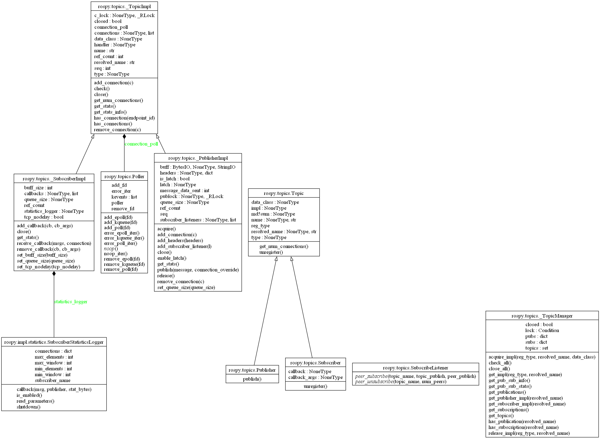

# rospy的Topic实现
## 解决的问题
ROS（Robot Operating System）的topic通信机制提供了一种发布/订阅模式，用于节点之间的数据交换。它解决了机器人系统中节点间通信的灵活性和可扩展性问题。

### 主要功能和解决问题：

1. **解耦发布者和订阅者**：
   - **功能**：ROS的topic机制通过中间代理（ROS Master）解耦发布者（Publisher）和订阅者（Subscriber）。
   - **解决问题**：发布者和订阅者无需直接通信，减少了相互依赖，使系统更加模块化和灵活。

2. **多对多通信**：
   - **功能**：多个节点可以发布或订阅同一个topic。
   - **解决问题**：支持复杂的通信拓扑结构，允许数据在多个节点之间共享。

3. **异步通信**：
   - **功能**：发布者和订阅者通过topic进行异步通信，不需要同步等待对方的响应。
   - **解决问题**：提高了系统的并发性能和实时性。

4. **透明的通信机制**：
   - **功能**：ROS的通信机制对用户透明，用户只需知道topic名称和消息类型即可进行数据交换。
   - **解决问题**：简化了通信实现，降低了开发复杂度。

5. **支持多种消息类型**：
   - **功能**：ROS支持多种消息类型，包括标准类型和用户自定义类型。
   - **解决问题**：满足不同类型数据的传输需求，增强了系统的扩展性。

6. **跨平台和跨网络通信**：
   - **功能**：ROS的topic机制支持跨平台和跨网络通信。
   - **解决问题**：支持不同设备和网络环境下的节点互通，增强了系统的兼容性和可移植性。

通过以上机制，ROS的topic通信有效地解决了机器人系统中节点间数据交换的复杂性和灵活性问题，提供了一个高效、模块化和可扩展的通信框架。

## 涉及实体
topic功能的实现涉及用户端和服务端两端的设计。

全局实体为：

**_TopicImpl** & **_PublisherImpl** & **_SubscriberImpl**

用于管理实际的传输连接。

**_TopicManager**

负责跟踪系统范围内的发布和订阅状态以及 **_TopicImpl**实例。在后台记录本地节点与其管理topic的映射。**get_topic_manager()**这一方法是为了以单例模式使用

**_TopicManager**

用户端的关键实体为:

**Pubulisher** & **Subscriber**

客户端节点会实例化**Publisher**和**Subscriber**对象，从而与具体的Topic产生联系。

### 具体实现【待补全】

**_TopicImpl**

**_PublisherImpl**

**_SubscriberImpl**

**_TopicManager**

**Pubulisher**

**Subscriber**

## 数据流
