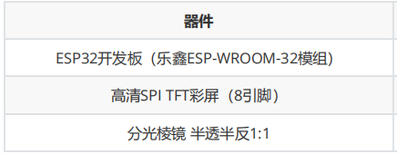

# 分光棱镜透明桌面小电视

## 背景

参考稚晖君的HoloCubic，DID迪的ESP32+TFT+分光棱镜实现透明小电视和旺仔爸爸造物社的透明手表教程。

参考博客

https://did321.github.io/
homepea.top

mp.weixin.qq.com

参考文档

心知天气 API 使用手册（V3版） · 心知天气seniverse.yuque.com

参考代码

链接：https://pan.baidu.com/s/1Y9dfTDE5_D-sQmDviOE_bA 

提取码：sd9u

创意来源——稚晖君HoloCubic

这个小东西真的非常可爱！！很难拒绝透明的闪闪发光的屏幕！❤
                 

## 方案
### 1. 原理解释
1：1分光棱镜是用于分离光纤水平偏振和垂直偏振的光学元件，由两个三棱镜组成，投射反射1：1。

图1 分光棱镜原理图

可以从正面看到底部屏幕的镜像。

### 2.外观设计

图2 小电视外观设计图

### 3.系统设计

图3系统设计图

### 4.设想功能
1. 使用NTP服务显示时间

2. 使用心知天气API获取天气信息并显示

3. 图片播放

低配：手动烧录设置

高配：可以用手机上/PC上的前端软件上传图片播放

涉及技术：

- 硬件

图4硬件材料列表【引用】

- 软件

arduino开发平台

NTP时间服务

心知天气信息API

前端框架：vue

通讯协议：WIFI、TCP

## 过程
### 1.开发环境搭建
#### 1.1Arduino IDE下载与安装

图5官网网页

#### 1.2IDE配置ESP32开发板环境
打开文件-> 首选项->附加开发板管理器 输入 

https://dl.espressif.com/dl/package_esp32_index.json

以后进行库管理时将会通过这个索引文件访问代码仓库进行下载

图6开发板管理器

在本次项目中，务必使用以下配置好的开发板与库文件，避免错误：

链接：https://pan.baidu.com/s/1ZtDFc2J0y1mm9XN0a_U5Sg 

	提取码：f703

将文件解压后粘贴至Arduino IDE安装文件夹中的hardware文件夹中

图7hardware文件夹地址

打开工具，设置开发板参数如下图

图8开发板选择与设置

#### 1.3IDE配置相关库文件
##### 1.3.1库安装
需要使用的库如下所示，不需要额外安装
【注意】
如果在本项目开始前曾经自行下载以下库，请删除原有的库，使用上方链接中提供的库文件。

图9需求库清单

可以使用工具->管理库的功能确认是否曾经安装过库

图10 Arduino库管理工具
##### 1.3.2库配置
需要配置的库仅有TFT_eSPI库的设置文件

- 驱动设置

打开如下路径文件夹，只保留ST7735_128*128的驱动文件、SetupX_Tenplate、User_Custom三个文件，其他注释掉。

图11 驱动设置地址

修改驱动文件代码如下：

图12 驱动设置代码

【注意】白色框出部分为tft屏幕引脚与开发板连接的设置，如有改动，视具体情况而定
翻转显示设置

找到如下文件

图13 屏幕翻转设置地址

在switch代码块中增加一个case，如下：

图14 屏幕翻转设置代码

【注意】进行代码修改时尽量手敲，避免混入规定外字符造成编译错误
### 2.硬件接线
开发板与电脑连接

使用有数据通道的数据线连接开发板与电脑

打开IDE 工具，选择对应端口

图15 ArduinoIDE连接开发板

代码编写完成后，点击上方箭头将程序烧录到开发板上。

【注意】如果connecting一直没反应，可能需要按住开发板的boot键直到烧录完成

图16 程序烧录

开发板与TFT屏幕连接

接线方案如下所示，注意VCC也可能写为3V3，接线取决于IO号码，而不是开发板物理位置，

因为不同厂家开发板端口位置可能不同。

图17 接线示意【引用】
### 3.利用TFT库进行屏幕显示
常用函数
~~~c++
tft.init(); tft 初始化 
tft.fillScreen(Color); color 可用内置的也可以自己设置屏幕颜色 
tft.setCursor(X, Y, L); 设置起始坐标(X, Y)，L号字体 L:0~6 
tft.setTextColor(Color); 设置文本颜色 
tft.setTextSize(S); 设置文字的大小 S:(1~7) 
tft.println(Str); 显示文字字符串，仅可显示英文字符
tft.fillCircle(X,Y,R,Color); 画圆 以(X，Y)为圆心，R为半径。 
tft.drawLine(X1,Y1, X2, Y2, Color); 画线，起点（X1，Y1），终点（X2，Y2）。 
tft.drawPixel(X,Y,Color); 画点 （
X，Y） 
tft.setTextColor(fg,bg); 设置文字颜色fg和背景颜色bg。 
~~~

示例代码如下：
~~~c++
#include <SPI.h> //导入库 
#include <TFT_eSPI.h> 
  
TFT_eSPI tft = TFT_eSPI(); 
void setup() { 
 // put your setup code here, to run once: 
 tft.init();                               //初始化 
 tft.fillScreen(TFT_BLACK);                //屏幕颜色 
 tft.setCursor(10, 10, 1);                 //设置起始坐标(10, 10)，2 号字体 
 tft.setTextColor(TFT_YELLOW);             //设置文本颜色为白色 
 tft.setTextSize(2);                       //设置文字的大小 (1~7)
 }
~~~

### 4.WIFI连接创建
示例代码如下：
~~~c++
WiFi.begin(ssid, password);              // 连接网络
    while (WiFi.status() != WL_CONNECTED)    //等待wifi连接
    {
      delay(500);
      Serial.print(".");
    }
    Serial.println("WiFi connected");        //连接成功
    Serial.print("IP address: ");            //打印IP地址
    Serial.println(WiFi.localIP());
~~~

### 5.NTP服务使用
- 原理

**网络时间协议（Network Time Protocol，NTP）**是用来使计算机时间同步化的一种协议，它可以 使计算机对其服务器或时钟源(如石英钟，GPS等等)做同步化，它可以提供高精准度的时间校正，与标准时间的误差小于1ms。标准时间来源于原子钟，卫星，天文台等。

常用的NTP服务器 
~~~py
  pool.ntp.org     # 国外的NTP服务器，国内地址为：cn.pool.ntp.org 
  ntp.aliyun.com   # 阿里云 
  time1.cloud.tencent.com  # 腾讯 
  time.google.com # 谷歌 
  ntp.tuna.tsinghua.edu.cn # 清华大学 
  ntp.sjtu.edu.cn # 上海交通大学 
  ntp.fudan.edu.cn # 复旦大学 
~~~

- 例程

文件->例程->NTPClient->Basic，进行如下修改： 
~~~c++
#include <NTPClient.h> 
#include <WiFi.h> // for WiFi shield 
#include <WiFiUdp.h> 
const char *ssid    = "   ";  //wifi账号 
const char *password = "   ";  //wifi密码WiFiUDP ntpUDP; 
NTPClient timeClient(ntpUDP,"ntp.aliyun.com");  //NTP服务器地址 
void setup(){ 
 Serial.begin(115200); 
 //连接wifi 
 WiFi.begin(ssid, password); 
 while ( WiFi.status() != WL_CONNECTED ) { 
   delay ( 500 ); 
   Serial.print ( "." ); 
} 
 timeClient.begin(); 
} 
void loop() { 
 timeClient.update(); 
 //打印时间 
 Serial.println(timeClient.getFormattedTime()); 
 delay(1000); 
} 
~~~
【注意】由于时区，打印出来的时间和电脑中显示的时间并不同步，相差8个小时，需要手动调整

### 6.心知天气API使用
#### 6.1 建立TCP通信请求天气数据
示例代码
~~~c++
//创建TCP连接
    WiFiClient client;
    const int httpPort = 80;
    if (!client.connect(host, httpPort))
    {
      Serial.println("Connection failed");  //网络请求无响应打印连接失败
      return;
    }
    //URL请求地址
    String url 
="/v3/weather/daily.json?key=SeAeuMjbRTJo4I_ZN&location=guangzhou&language=zh-Hans&unit=c&start=0&days=5";
    //发送网络请求
    client.print(String("GET ") + url + " HTTP/1.1\r\n" +
              "Host: " + host + "\r\n" +
              "Connection: close\r\n\r\n");
    delay(2000);
    //定义answer变量用来存放请求网络服务器后返回的数据
    String answer;
    while(client.available())
    {
      String line = client.readStringUntil('\r');
      answer += line;
    }
      //断开服务器连接
    client.stop();
    Serial.println();
    Serial.println("closing connection");
~~~
#### 6.2 处理报文
利用官方网站的助手服务处理返回数据

图18 官方网站助手服务页面【引用】

图19 官方网站助手服务获取报文【引用】

解析后可以用于输出天气信息。
### 7.图片显示
#### 7.1 原理
将汉字，图片用取模软件转为像素点存储颜色的代码形式后，就可以用TFT_eSPI库提供的方法输出：
设置如下，存储为c文件

图20 图片取模设置

图21 图片文件保存

将取模的图片做成头文件包入：

图22 头文件设置

示例代码：
~~~c++
tft.fillScreen(TFT_BLACK);
      tft.setSwapBytes(true);             
//使图片颜色由RGB->BGR
     tft.pushImage(0, 0, 128, 128, resting_nomi);
//前两个参数为初始坐标，三四为图片大小（像素），五为头文件中的图片名称
      delay(3000);
      tft.pushImage(0, 0, 128, 128, dusk);
      delay(3000);
      tft.pushImage(0, 0, 127, 128, cloud);
      delay(3000);
      tft.pushImage(0, 0, 128, 128, sky);
      delay(3000);
      tft.pushImage(0, 0, 128, 128, fighting_nomi);
      delay(3000);
~~~

## 实际效果

图23 效果展示

希望我踩过的坑能帮到你！
