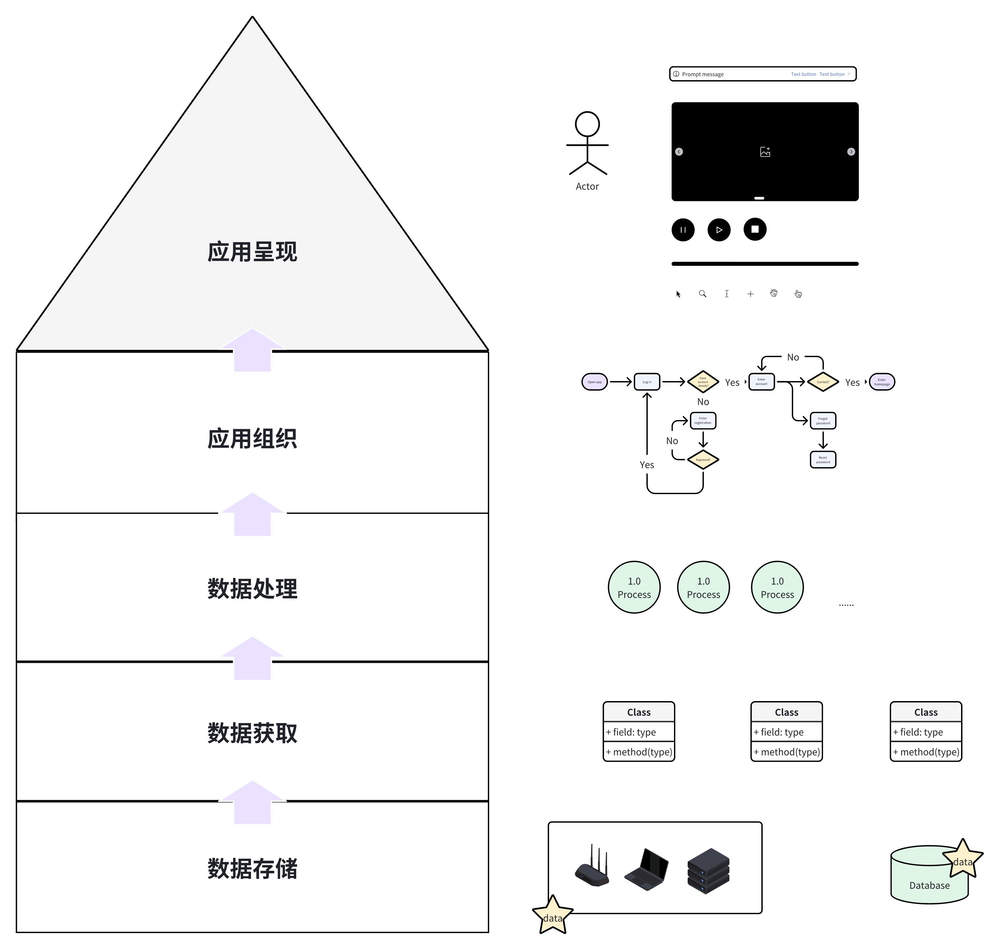

# 欢迎来到NOMI的wiki

Hi! This is NOMI!
这个wiki用于整理我对构建可用系统的学习思考，毕竟我是做笔记/整理题型狂魔😆

## wiki的基本结构
“系统”在本wiki中表示集成了硬件和软件，获取、存储并处理数据，为使用者解决具体应用场景中问题的东西。
从粗糙的分层构建对最小系统的认识，厘清每层具体涉及的环节，针对环节的基本实现/异常处理/安全处理/性能优化提出问题，逐一给出解决思路/伪代码/可用代码。

计划的结构如下：  

- Introduction:
  - introduction/introduction.md
- 数据编码与存储:
  - data_encode_store/introduction.md
  - 字符编码格式:
  - 文件格式:
    - 文本:
    - 图像:
    - 视频:
    - 音频:
    - 3D资产:
  - 常用存储:

- 数据获取:
  - data_access/introduction.md
  - 从设备获取数据:
  - 从数据库获取数据:
  - 从网络API获取数据:
  - 实体间通信:

- 数据处理:
  - data_process/introduction.md
  - 编码格式处理:
  - 文件格式处理:
  - 常用数据结构处理:
    - 数组:
    - 链表:
    - 树:
    - 堆:
    - 图:
  - 较复杂问题:
    - CV:
    - NLP:
    - DL:
    - RL:
- 应用集成:
  - application/introduction.md
  - 常见框架的适用场合:
  - 各类型数据呈现:
  - 界面跳转:

## 声明
wiki可能存在错误，欢迎指出（可在github提issue或者发邮件），作者会积极提供咖啡☕  
wiki必然不是完备的，人生也有涯，而知也无涯，作者希望在精力充沛的时间尽可能多做出些实物来，那么就不要在意那么多细节啦！

