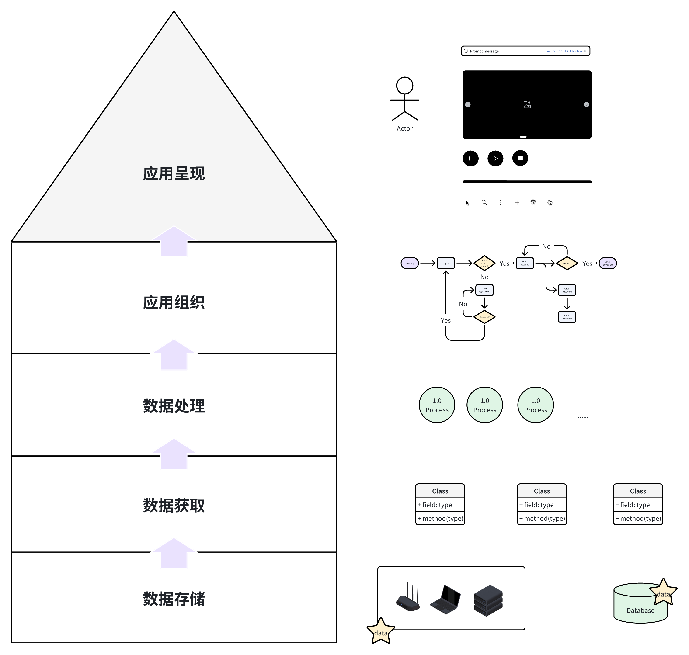

# 欢迎来到NOMI的wiki

Hi! This is NOMI!
这个wiki用于整理我对构建可用系统的学习思考，毕竟我是做笔记/整理题型狂魔😆

## wiki的基本结构
“系统”在本wiki中表示集成了硬件和软件，获取、存储并处理数据，为使用者解决具体应用场景中问题的东西。
从粗糙的分层构建对最小系统的认识，厘清每层具体涉及的环节，针对环节的基本实现/异常处理/安全处理/性能优化提出问题，逐一给出解决思路/伪代码/可用代码。

## 声明
wiki可能存在错误，欢迎指出（可在github提issue或者发邮件），作者会积极提供咖啡☕  
wiki必然不是完备的，人生也有涯，而知也无涯，作者希望在精力充沛的时间尽可能多做出些实物来，那么就不要在意那么多细节啦！

